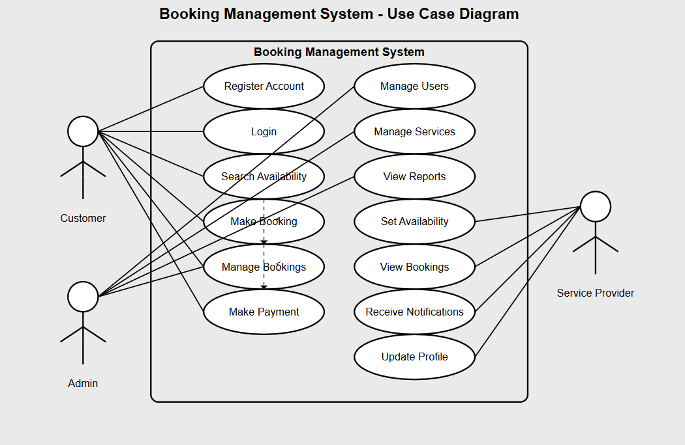

# 📌 Requirement Analysis in Software Development
# 📘Introduction
Welcome to airbnb-clone-project requirement analysis, a project focused on showcasing the importance of requirement analysis in software development. This repository outlines a structured approach to identifying, documenting, and analyzing stakeholder requirements before initiating the development process. By emphasizing early-stage planning, airbnb-clone-project requirement analysis aims to reduce development risks, enhance product quality, and ensure alignment with user needs. Whether you're a student, developer, or project manager, this project provides insights and templates to help you conduct thorough requirement analysis for any software solution.

---
## 📚 What is Requirement Analysis?
**`Requirement Analysis`** is a critical phase in the software development lifecycle (SDLC) where the project team `gathers`, `analyzes`, and `defines` the requirements of the software product to be developed. This process ensures that all stakeholders have a clear and mutual understanding of what the system should do and how it should perform.

---
## ❗ Why is Requirement Analysis Important?
+ [X] **`Clarity and Understanding`:** It helps in understanding what the stakeholders expect from the software, reducing ambiguity.
+ [X] **`Scope Definition`:** Clearly defines the scope of the project, which helps in preventing scope creep.
+ [X] **`Basis for Design and Development`:** Provides a solid foundation for designing and developing the system.
+ [X] **`Cost and Time Estimation`:** Facilitates accurate estimation of project cost, resources, and time.
+ [X] **`Quality Assurance`:** Ensures that the final product meets the specified requirements, leading to higher customer satisfaction.

---
## 📌 Key Activities in Requirement Analysis
+ [X] `Requirement Gathering`
      
    + **This involves collecting high-level information from stakeholders about what they expect from the Airbnb Clone. Sources may include interviews, surveys, existing platforms, and 
        business documents.**
      
+ [X] `Requirement Elicitation`
        
   + **Elicitation digs deeper into stakeholder needs by using techniques like brainstorming sessions, use case development, and user 
       stories to uncover implicit and explicit requirements of both hosts and guests.**
  
+ [X] `Requirement Documentation`
        
   + **All gathered and elicited requirements are clearly documented using tools like SRS (Software Requirements Specification), user 
         stories, or feature lists to ensure clarity and traceability.**
  
+ [X] `Requirement Analysis and Modeling`
        
   + **In this stage, the requirements are analyzed for feasibility, consistency, and completeness. Models such as use case diagrams, 
         user flowcharts, and wireframes are used to visualize how the system should behave.**
  
+ [X] `Requirement Validation`
        
   + **The documented requirements are reviewed and validated with stakeholders to ensure they align with business goals and user 
         expectations, minimizing risks of rework later in development.**

---
## 🧩Types of Requirements

   ### 1. Functional Requirements 
  
`Functional requirements` define the specific behaviors and functionalities of the system. For the **`Airbnb Clone Project's booking management system**`, examples include:

- **`User Registration and Authentication`**: Users (hosts and guests) can create accounts, log in, and manage their profiles.
- **`Property Listing Management`**: Hosts can add, update, or remove property listings with details like descriptions, pricing, and availability.
- **`Search and Filter Listings`**: Guests can search for properties based on location, date, price range, and other filters.
- **`Booking Functionality`**: Guests can request or instantly book available properties for specified dates.
- **`Payment Processing`**: Secure handling of payments between guests and hosts, including refunds and cancellations.
- **`Review and Rating System`**: After a stay, guests and hosts can leave reviews and ratings for each other.

   ### 2. Non-functional Requirements

`Non-functional requirements` pertain to how the system performs rather than what it does. For the booking management system, examples include:

- **`Scalability`**: The system should handle an increasing number of users and bookings without performance degradation.
- **`Performance`**: Pages and booking processes should load and execute within acceptable time frames.
- **`Security`**: User data and payment information must be protected through encryption and secure protocols.
- **`Availability`**: The system should have high uptime, especially during peak booking periods.
- **`Maintainability`**: The codebase should be organized and documented to support future updates and fixes.
- **`Compliance`**: The system should adhere to relevant legal and regulatory standards, such as data protection laws.
      
--- 
## 🎯Use Case Diagrams

>>### What Are Use Case Diagrams?

**`Use Case Diagrams`** are a type of behavioral diagram defined by UML (Unified Modeling Language) that visually represent the functional requirements of a system. They illustrate how`users (actors)` interact with the system to achieve `specific goals (use cases)`. These diagrams provide a high-level overview of system functionalities and user interactions.

### Benefits of Use Case Diagrams

+ **`Clarity:`** They help stakeholders understand system functionality from a user perspective.
+ **`Communication:`** They serve as an effective communication tool between technical and non-technical team members.
+ **`Scope Management:`** They help define system boundaries and identify all possible interactions.
+ **`Requirement Validation:`** They assist in validating that all user expectations are captured in the system.
>>### 📌 Use Case Diagram for the Booking Management System

Below is the use case diagram for the ALX Booking Management System. It highlights the major actors and the key actions they can perform in the system.

>### Actors:
1. **`User (Guest):`** Interacts with the system to search, book, and manage reservations.
1. **`Admin:`** Manages room availability, user data, and oversees system functions.
1. **`Payment Gateway:`** Handles transaction processing and confirmations.

>### Key Use Cases:
1. Search Available Rooms  
1. Make Booking  
1. Modify/Cancel Booking  
1. View Booking History  
1. Process Payment  
1. Manage Room Inventory (Admin)  
1. View Reports and Analytics (Admin)
## ✅ Acceptance Criteria

>### Importance of Acceptance Criteria in Requirement Analysis

`Acceptance Criteria` are conditions that a software product must satisfy to be accepted by a `user`, `customer`, or `other stakeholders`. They define the boundaries of a user story or feature and ensure that everyone involved in the project has a shared understanding of the expected outcome.

>**Why Acceptance Criteria Matter:**
+ 🧭 **`Clarity:`** They provide clear and measurable expectations for what a feature should do.
+ 🧪 **`Testability:`** They serve as the basis for test cases and QA validation.
+ 🔄 **`Alignment:`** They help developers, testers, and stakeholders stay aligned on the scope and functionality.
+ 📦 **`Deliverability:`** They ensure that features meet user needs before being marked as complete.

---
>## `Example`: Acceptance Criteria for Checkout Feature
>
>>**`Feature:`** Checkout for Booking Management System

✅Acceptance Criteria:
+ [X] The user must be able to view a summary of their booking, including dates, room type, and total cost.
+ [X] The system must support secure payment through the integrated Payment Gateway.
+ [X] The booking is only confirmed after successful payment authorization.
+ [X] A booking confirmation email must be sent to the user immediately after successful checkout.
+ [X] If the payment fails, the user must be notified with an appropriate error message and allowed to retry.
+ [X] The system must update room availability after a successful checkout to prevent overbooking.

These criteria help ensure the Checkout feature delivers value, works as expected, and aligns with the business goals.

  
